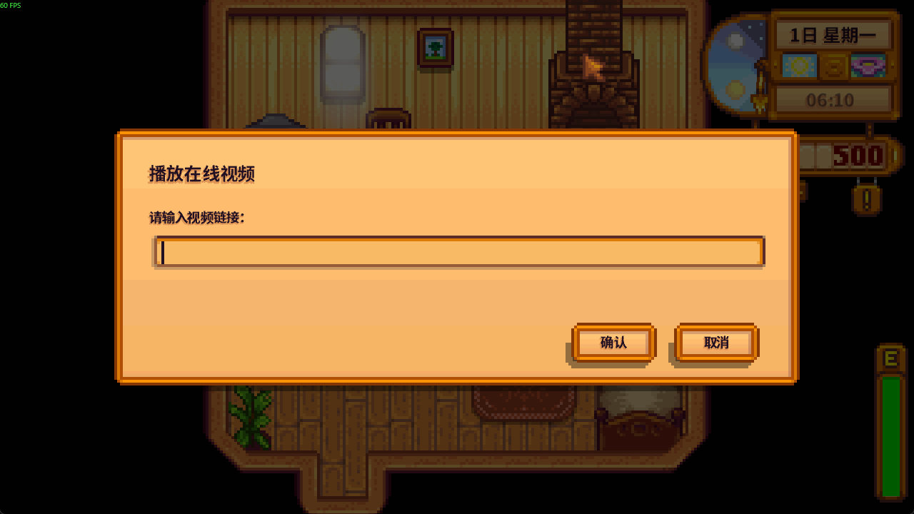
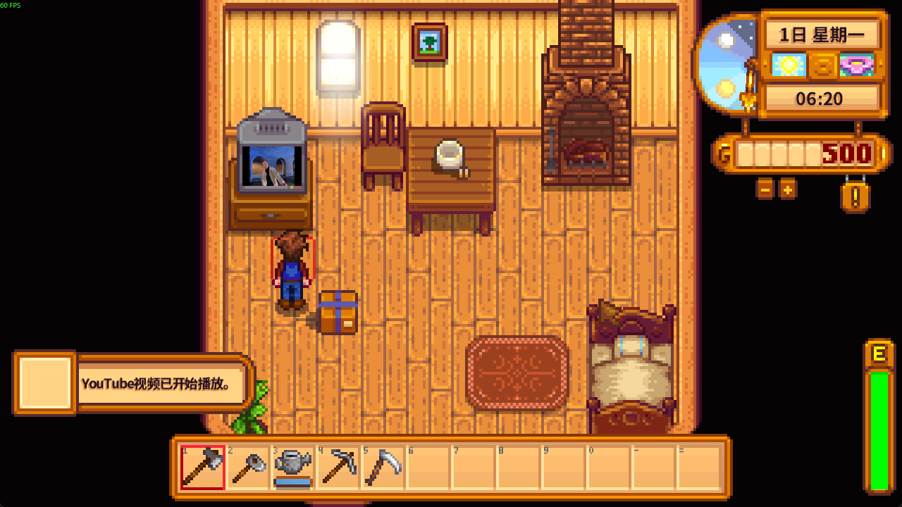
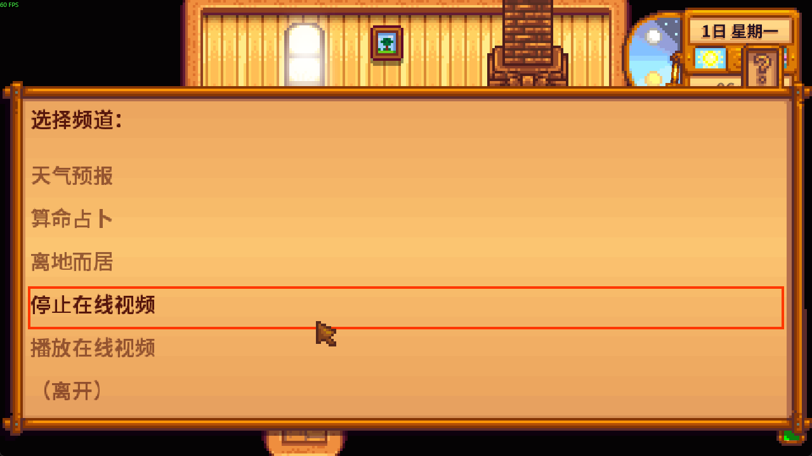

# ValleyVision

[简体中文](README.md) | English

ValleyVision is an independent Stardew Valley SMAPI mod. It adds a “播放在线视频” (Play Online Video) option to the original TV channel menu so you can enter a public Bilibili or YouTube video link and play picture and sound on the selected TV. Mod-added interface text is currently in Chinese. Original TV channels remain available. The source code is under the [MIT License](LICENSE).

Supported links: HTTPS Bilibili BV video pages, valid `b23.tv` links leading to a BV video, valid `?p=` part selections, HTTPS `youtube.com/watch?v=...` links (including `www` and `m`), and `youtu.be/...` single-video links. A YouTube watch link with playlist parameters plays only the specified video from the beginning. Shorts, livestreams, playlist-only pages, login-only, age-restricted, members-only, and paid videos are unsupported. PO Tokens are not handled.

The 0.1.0 candidate ZIP was installed in an isolated mod directory and observed in-game with a dedicated save on Windows, Stardew Valley 1.6.15 (Steam), and SMAPI 4.5.2. The player confirmed Bilibili and YouTube playback, stopping, natural end, returning to original TV channels, leaving the location, and recovery after an unsupported or unavailable link. Other platforms and versions remain untested; playback also depends on the network, video access, and external tool versions.

## Screenshots

These screenshots show the development build's link input, YouTube playback, and stop option. The candidate ZIP was tested separately from an isolated installation with a dedicated save.







## Installation and use

1. Install Stardew Valley and SMAPI 4.5.2 or newer.
2. Extract the `ValleyVision` folder from the release ZIP into the game's `Mods` directory. `Mods/ValleyVision` should directly contain `ValleyVision.dll` and `manifest.json`.
3. Install Windows [yt-dlp](https://github.com/yt-dlp/yt-dlp/wiki/Installation) (`yt-dlp.exe`) and an [FFmpeg Windows build](https://ffmpeg.org/download.html) that provides `ffmpeg.exe` and `ffplay.exe`. Put all three executables on `PATH`, or enter their absolute paths in `Mods/ValleyVision/config.json`. They are not bundled with the mod. The official standalone `yt-dlp.exe` does not require Python.
4. Click a TV and choose “播放在线视频” (Play Online Video). Enter or paste a supported link. Click the playing TV again and choose “停止在线视频” (Stop Online Video) to stop; choosing an original channel also stops the current video.

Example `config.json` (change the paths to match your installation):

```json
{
  "YtDlpPath": "C:\\Tools\\yt-dlp.exe",
  "FfmpegPath": "C:\\Tools\\ffmpeg.exe",
  "FfplayPath": "C:\\Tools\\ffplay.exe",
  "YouTubeJsRuntime": "deno",
  "YouTubeJsRuntimePath": "C:\\Tools\\deno.exe"
}
```

The first three paths may be empty or `null` when the programs are on `PATH`. YouTube extraction may also need a JavaScript runtime. Follow the [yt-dlp EJS guide](https://github.com/yt-dlp/yt-dlp/wiki/EJS) for a supported Deno or Node installation. Deno can be detected by yt-dlp by default. Node requires version 22 or newer and must be explicitly enabled with `YouTubeJsRuntime: "node"`. If you set `YouTubeJsRuntimePath`, also set its runtime type. The official `yt-dlp.exe` includes EJS components.

ValleyVision uses `--ignore-config`: it does not read your yt-dlp configuration or browser cookies, automatically download tools or EJS, persist entered links, or log full media addresses. Sound is played by the external `ffplay` process and does not follow the game's volume slider. The video session is cleaned up when it ends, when you stop it, when you leave the location, or when you return to the title screen. Missing tools, extraction failures, and playback interruptions show an in-game error message.

## Uninstall and troubleshooting

Close the game and remove `Mods/ValleyVision` to uninstall. If playback fails, check `yt-dlp --version`, `ffmpeg -version`, and `ffplay -version`, then verify your configured paths, public access to the video, and the [EJS guide](https://github.com/yt-dlp/yt-dlp/wiki/EJS) for YouTube. Share only redacted SMAPI logs and reproduction steps; avoid posting private links or media addresses.

## Build from source

The project targets .NET 6 and uses `Pathoschild.Stardew.ModBuildConfig` 4.4.0. Copy `ValleyVision.Local.props.example` to `ValleyVision.Local.props`, set `GamePath` to your own Stardew Valley installation, then run:

```powershell
dotnet restore ValleyVision.sln
dotnet build ValleyVision.sln --configuration Release
```

Regular builds do not deploy to the game directory by default. `ValleyVision.Local.props`, build output, and local configuration are ignored by Git.
